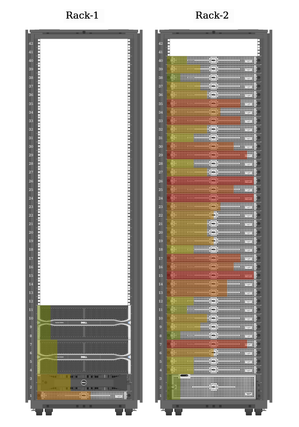

# Alces Concertim Visualisation App

## Overview

Concertim Visualisation App allows visualising devices and their reported metrics.

## Usage

Racks and devices can be added and removed using the rack and device API.  Once
devices have been added, metrics can be reported for those devices using the
[metric reporting
daemon](https://github.com/alces-flight/concertim-metric-reporting-daemon).

This repo contains [rack and device API example scripts](docs/api/examples).
The metric reporting daemon repository has its own [metric API example
scripts](https://github.com/alces-flight/concertim-metric-reporting-daemon/tree/main/docs/examples).

Once metrics have been reported they can be visualised using the interactive
rack view which runs in a browser.

## Development

TBD: complete this section.

## Deployment

Concertim Visualisation App is deployed as part of the Concertim appliance
using the [Concertim ansible
playbook](https://github.com/alces-flight/concertim-ansible-playbook).

## Copyright and License

Copyright (C) 2022-present Stephen F Norledge & Alces Flight Ltd.
